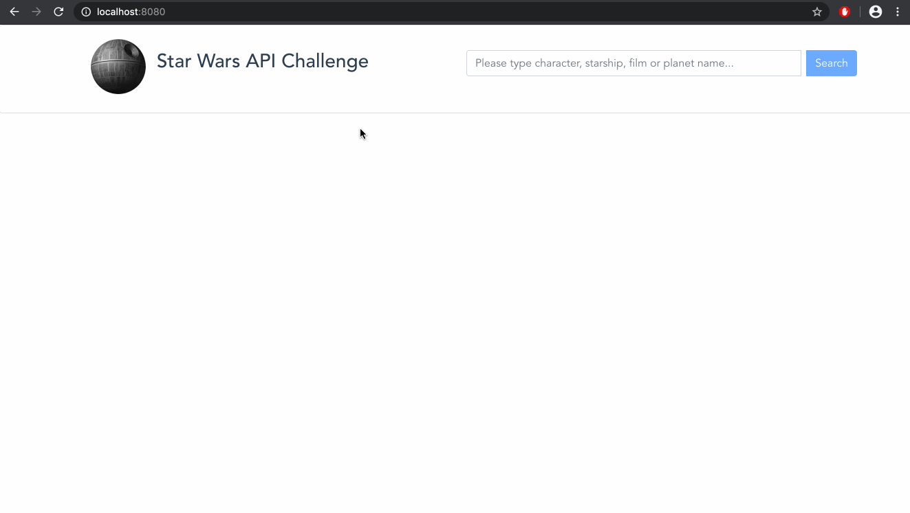
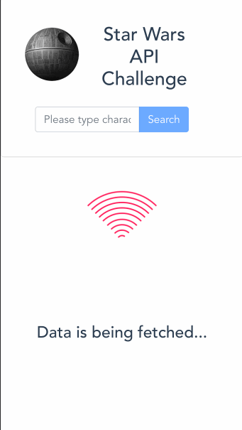

# Swapi Project with VueJS

## Project setup
```
npm install
```

## Compile and run the project locally
```
npm run serve
```

### Preview of the project on Browser



### Preview of the project on Mobile screen



## About the Project

 - This is a small SPA created with **VueJS**
 - It fetches all the data displayed on front end from [Swapi - Star Wars API](https://swapi.co/documentation)
 - Dynamic list includes characters, movies, planets and starships and corresponding information about the features of each
 - Swapi API response has pagination to limit the data, therefore all data is based on first 10 item (10 films, 10 planets...). Avoided unnecessary load of data
 - Every data can be searched based on their names
 - If search is successful, it will list 3-4 cards including related information (see preview above)
 - If search key does not match any of the names of characters, planets etc. it will show a small alert for the user
 - Application is fully responsive for all kinds of screens
 - **Bootstrap Vue** has been used for styling and responsiveness (almost no CSS)
 - **Vuex** has been utilised for state management and mutations
 - **Timeout** has been set for about 2 sec after final requests to visualise neat fingerprint loading spinner for the user

### Customize configuration
See [Configuration Reference](https://cli.vuejs.org/config/).
